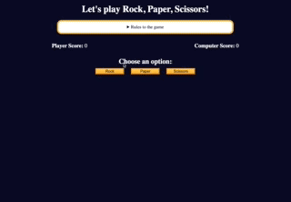

## ROCK SCISSORS PAPER APP

The application was built as a mini project for a JavaScript Algorithms and Data Structures course with FreeCodeCamp. Developed with HTML, CSS, and JavaScript, it reinforces JavaScript fundamentals, specifically DOM manipulation, functions, conditionals, and getElementById.

## Features

- A traditional rock, scissors, paper game where the user plays agains the computer;
Button that shows the rules to the game;
- 3 buttons with the options to the game: rock, scissors, paper;
- Once a player wins the game, it starts over.

## Technologies

- HTML
- CSS
- JavaScript

## Start the App

In the project directory, you can run it with the Live Server by right-clicking on index.html.

It will run the app in development mode.\
Open [http://127.0.0.1:5500](http://127.0.0.1:5500/index.html) to view it in your browser.

When making changes, reload them to see them on the page.

### Author

[Tanimara Elias Santos](https://github.com/tanimaraeliassantos)

### Version

1.0.0